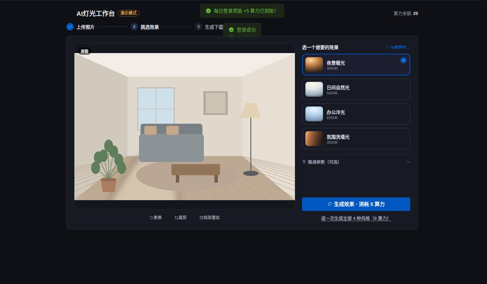
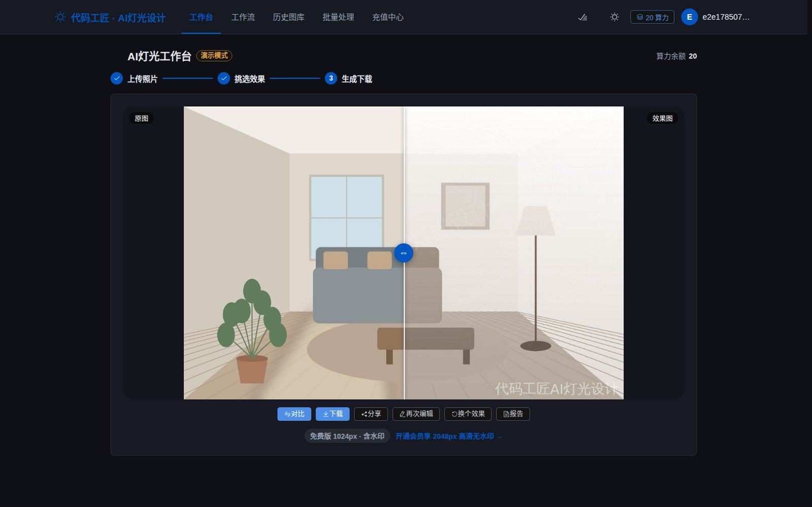
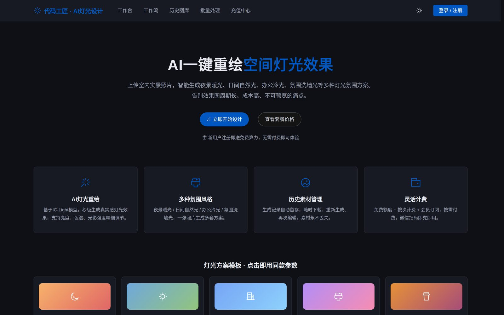

# 代码工匠 · AI灯光设计SaaS工具

面向室内设计师、建筑设计师、装修业主的AI灯光重绘在线工具。上传室内实景照片，AI智能重绘空间灯光效果，生成夜景暖光、日间自然光、办公冷光、氛围洗墙光等多种灯光氛围方案。

具备完整SaaS闭环：**注册登录（JWT）→ 免费算力 → AI出图 → 按次扣费 → 历史图库 → 微信充值 → 会员订阅 → 后台数据统计**。

## 界面速览

### 工作台 · AI 预选参数 + 按次计费



> 三步向导（上传照片 → 挑选效果 → 生成下载）。右侧四种灯光风格各自标注色温；**「AI 已为你预选」会先分析照片的亮度与色调，给出推荐风格并附上理由**（截图里是「照片色调偏暖，适合氛围洗墙光方案：3500K 配合较强光影层次」），而不是让用户面对四个选项自己猜。按钮上直接写明本次消耗多少算力——计费不藏在流程后面。

### 前后对比 · 免费版含水印，会员高清无水印



> 拖动滑块对比原图与效果图：右半边整个空间被 3500K 暖光洗过，墙面色温、地板明暗层次、右侧灯具的光晕都随之改变。底部那行是完整商业闭环的落点：**免费版 1024px 带水印，会员 2048px 高清无水印**——出图质量与付费档位直接挂钩，而不是靠限制次数。

### 首页




## 文档导航

| 文档 | 内容 | 适合谁 |
|---|---|---|
| 本README | 项目总览、快速启动、配置说明 | 所有人 |
| [docs/API.md](docs/API.md) | 全部接口定义、开放API调用示例 | 前后端/集成方 |
| [docs/部署运维手册.md](docs/部署运维手册.md) | 服务器选型、上线部署、HTTPS、备份、安全加固、扩容路线 | 运维/上线负责人 |
| [docs/二次开发指南.md](docs/二次开发指南.md) | 架构设计、代码地图、表结构、常见扩展做法、开发规范 | 接手的工程师 |
| [docs/Lint配置指南.md](docs/Lint配置指南.md) | ESLint/Prettier 代码规范与格式化 | 开发者 |
| [docs/常见问题FAQ.md](docs/常见问题FAQ.md) | 安装启动/功能使用/对接真实服务/数据迁移排障 | 所有人 |
| [docs/改进方案-竞品对比版.md](docs/改进方案-竞品对比版.md) | 竞品分析与产品迭代路线图（P0已落地→P2） | 产品决策 |

## 一键启动（推荐）

macOS双击根目录的 **启动.command**，或终端运行 `./start.sh` —— 自动检查Node、安装依赖、生成配置、启动前后端并打开浏览器；Ctrl+C 一键全停。

## 根目录快捷命令

根目录 `package.json` 汇总了全部常用命令（`npm run` 查看完整列表）：

| 命令 | 作用 |
|---|---|
| `npm run setup` | 一次装齐前后端依赖 |
| `npm run dev` | 本地开发（等同 ./start.sh，前后端一起起） |
| `npm test` | 跑全部测试（后端接口 + 前端组件） |
| `npm run test:e2e` | Playwright 端到端测试 |
| `npm run build` / `npm run prod` | 打包前端 / 打包并单端口起生产模式 |
| `npm run seed` / `npm run smoke` | 演示种子数据 / 冒烟验证 |
| `npm run deploy:prod` / `deploy:staging` / `deploy:demo` | Docker 三环境一键部署 |

## 技术栈

| 层 | 技术 |
|---|---|
| 前端 | Vue3 + Vite + Pinia + Vue Router + Element Plus + Axios + SCSS |
| 后端 | Node.js + Express + JWT + SQLite |
| AI | IC-Light 灯光重绘模型（Replicate 可配置）+ 本地模拟模式 |
| 支付 | 微信 Native 支付 V3（真实对接）+ 沙箱模拟模式 |

## 目录结构

```
ai-light-studio/
├── server/            # 后端服务
│   ├── src/
│   │   ├── index.js       # 服务入口（生产模式自动托管前端dist）
│   │   ├── config.js      # 配置与充值套餐定义
│   │   ├── db.js          # SQLite数据库（自动建表）
│   │   ├── middleware/    # JWT鉴权、管理员校验
│   │   ├── services/      # AI出图 / 微信支付 / 算力流水
│   │   └── routes/        # auth / generate / credits / pay / stats
│   └── .env.example       # 环境变量模板
├── web/               # 前端工程
│   └── src/
│       ├── views/         # 首页/登录/工作台/图库/充值/订单/个人中心/统计
│       ├── stores/        # Pinia（用户、主题）
│       ├── api/           # Axios封装 + 全部接口
│       └── styles/        # Mokika视觉风格 + 双主题
└── docs/API.md        # 接口说明文档
```

## 快速启动（本地开发）

环境要求：Node.js ≥ 18（推荐 20/22）

```bash
# 1. 后端
cd server
cp .env.example .env        # 按需修改配置
npm install
npm run dev                 # http://localhost:3000

# 2. 前端（新终端）
cd web
npm install
npm run dev                 # http://localhost:5173（已配置代理到3000）
```

打开 http://localhost:5173 → 注册账号（自动赠送20算力）→ 工作台上传照片 → 生成。

> `.env` 中 `ADMIN_EMAILS` 包含的邮箱注册后自动成为管理员，可访问「数据统计」页面。

## 运行模式说明

### AI出图
- `AI_PROVIDER=mock`（默认）：本地图像处理模拟灯光效果（色温/亮度/光影/氛围渐变），无需任何密钥，全流程可跑通演示。
- `AI_PROVIDER=replicate`：对接 Replicate 上的 IC-Light 模型。在 `.env` 填写：
  ```
  AI_PROVIDER=replicate
  REPLICATE_API_TOKEN=r8_xxx
  REPLICATE_MODEL_VERSION=<模型version id>
  ```
  如使用其他IC-Light服务商，只需修改 `server/src/services/ai.js` 中 `replicateRelight` 一个函数。

### 微信支付
- `PAY_PROVIDER=mock`（默认）：沙箱模拟。下单返回模拟二维码，弹窗内有「模拟支付成功」按钮跑通完整充值到账流程。
- `PAY_PROVIDER=wechat`：真实微信Native支付V3。在 `.env` 填写商户参数：
  ```
  PAY_PROVIDER=wechat
  WXPAY_APPID=wx...
  WXPAY_MCHID=商户号
  WXPAY_SERIAL=商户API证书序列号
  WXPAY_PRIVATE_KEY_PATH=./cert/apiclient_key.pem
  WXPAY_APIV3_KEY=32位APIv3密钥
  WXPAY_NOTIFY_URL=https://你的域名/api/pay/notify
  ```
  回调地址必须为公网HTTPS。签名、下单、回调解密均已按官方V3规范实现，无需额外SDK。

### 数据库
默认SQLite（`server/data/app.db`，自动创建）。优先使用 better-sqlite3，环境无法编译原生模块时自动降级为 Node 内置 `node:sqlite`（Node ≥ 22.13），业务代码零改动。后续如需迁移MySQL，仅需替换 `server/src/db.js`。

## 生产部署

### Docker 多环境一键部署（推荐）

```bash
./deploy.sh production          # 生产 :3000（真实AI+支付，配置在 deploy/env/production.env）
./deploy.sh staging             # 测试 :3001（类生产，支付沙箱）
./deploy.sh demo --seed         # 演示 :3002（全mock + 演示账号，开箱即用）

./deploy.sh <env> status|logs|down|seed|smoke    # 环境管理
```

三套环境同机并行、数据卷隔离；`--smoke` 部署后自动跑7项冒烟验证。推送 GitHub 后 CI 自动跑测试（`.github/workflows/ci.yml`），打 `v*` 标签自动发布镜像到 GHCR（`release.yml`）。详见 [docs/部署运维手册.md](docs/部署运维手册.md)。

### 宿主机部署

```bash
# 1. 打包前端
cd web && npm install && npm run build     # 产物在 web/dist

# 2. 启动后端（自动托管 web/dist，单端口即可上线）
cd ../server && npm install --omit=dev
cp .env.example .env                        # 修改 JWT_SECRET、支付、AI配置
node src/index.js                           # 或 pm2 start src/index.js --name ai-light
```

Nginx 反向代理示例：

```nginx
server {
    listen 443 ssl;
    server_name your-domain.com;
    client_max_body_size 20m;
    location / {
        proxy_pass http://127.0.0.1:3000;
        proxy_set_header Host $host;
        proxy_set_header X-Real-IP $remote_addr;
    }
}
```

上线检查清单：
1. `JWT_SECRET` 改为随机长字符串
2. `PAY_PROVIDER=wechat` 并配置商户证书，`WXPAY_NOTIFY_URL` 指向公网域名
3. `AI_PROVIDER=replicate` 并填写Token
4. `ADMIN_EMAILS` 设置为你的管理员邮箱
5. 定期备份 `server/data/` 目录（数据库+图片素材）

## 计费规则（可在 config.js / .env 调整）

- 新用户注册赠送 20 算力（`FREE_CREDITS`），每日登录再送 5 算力（`DAILY_CREDITS`）
- 单张生成消耗 5 算力（`COST_PER_GENERATION`）；一键4风格连拍消耗 8 算力（`MULTI_COST`）；失败自动退还
- 免费用户出图 1024px + 水印；会员或已付费用户 2048px 高清无水印（`FREE_MAX_SIZE` / `PREMIUM_MAX_SIZE` / `WATERMARK_TEXT`）
- 充值套餐与会员套餐在 `server/src/config.js` 的 `packages` 中定义，价格单位为分

## P1/P2 功能清单

- **局部灯光重绘**：工作台"局部重绘"画笔涂抹选区，仅重绘涂抹区域（边缘自动羽化）
- **AI灯光顾问**：分析照片亮度/色调，一键推荐风格、色温、亮度、光向参数
- **灯光方案报告**：一键生成专业报告页（原图+效果+参数+照明建议），浏览器导出PDF
- **作品分享+邀请裂变**：作品生成公开分享页（带对比滑块），好友经邀请链接注册双方各得10算力
- **方案模板库**：首页6套场景模板（客厅暖夜/通透日光/高效办公等），点击直接套用参数
- **批量处理**：一次最多20张统一参数出图，会员/付费用户专属
- **管理后台**：数据总览 + 用户管理（搜索/调整算力/封禁）+ 生成内容抽查
- **开放API**：个人中心创建 API Key，第三方系统携带 `X-API-Key` 头即可集成出图能力

## 邮箱服务

配置 `SMTP_*` 后自动启用真实邮件发送（验证码注册、找回密码）；未配置时为开发模式，验证码打印到控制台并随接口返回，流程照常可跑通。`EMAIL_VERIFY=on` 可强制注册校验邮箱验证码。

## 接口说明

见 [docs/API.md](docs/API.md)。统一返回 `{ code, msg, data }`；错误码：401未登录、403权限不足、429算力不足、500服务异常。

## 功能总览（当前版本）

用户侧：注册登录（邀请码/邮箱验证码/找回密码）、每日签到奖励、上传/裁剪、单张生成、4风格连拍、局部重绘画笔、光源方向、AI灯光顾问、前后对比滑块、历史图库、方案报告导出PDF、作品分享页、方案模板库、批量处理（会员）、充值/会员/订单/明细、双主题。

管理侧：数据总览与7日趋势、用户搜索/调整算力/封禁、生成内容抽查。

开放能力：API Key（X-API-Key）供第三方系统集成出图。

## 下一步路线（未实现，按需开发）

内容审核接入（国内上线合规）、图片OSS+CDN、Redis生成队列、LLM版灯光顾问、昼夜渐变视频导出、灯具电商联动。详见改进方案文档P2部分与二次开发指南第4节的扩展做法。

## 测试体系（三层）

| 层级 | 技术 | 数量 | 运行 |
|---|---|---|---|
| 后端接口测试 | Vitest + Supertest | 42例：认证/算力/生成/支付/退款/上传校验/限流/密钥/后台/错误日志 | `cd server && npm test` |
| 前端组件测试 | Vitest + Vue Test Utils | 15例：图库弹窗唯一性/工作台交互/充值流程/协议拦截/对比滑块 | `cd web && npm test` |
| E2E冒烟测试 | Playwright（真实浏览器） | 注册→上传出图→图库对比→模拟充值到账，余额精确断言 | `cd web && npx playwright install chromium`（首次）→ `npm run test:e2e` |

所有测试使用独立临时数据库，不影响真实数据。E2E会自动拉起前后端（独立E2E数据目录）。若服务已手动启动，可用 `npx playwright test -c playwright.ci.config.js`。

## 排障

遇到问题先查 [docs/常见问题FAQ.md](docs/常见问题FAQ.md)；未覆盖的问题带上后端控制台报错日志排查。
